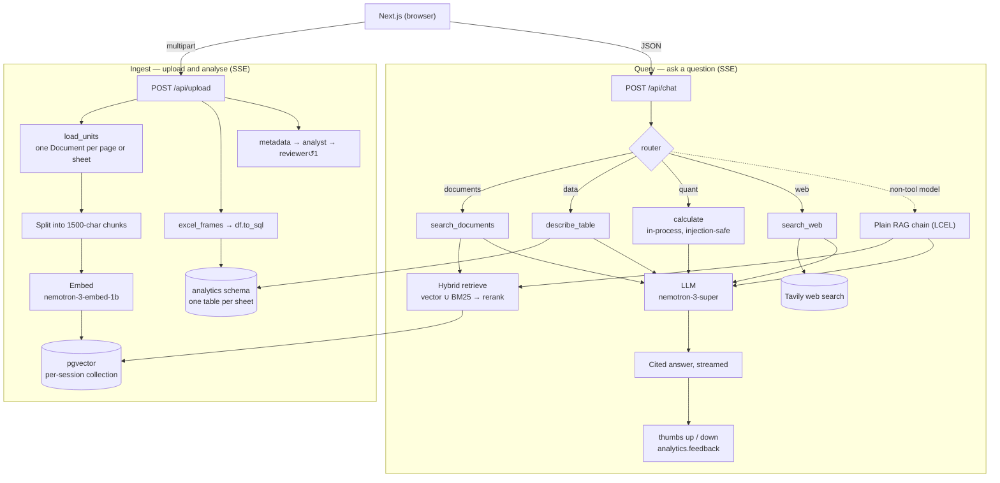
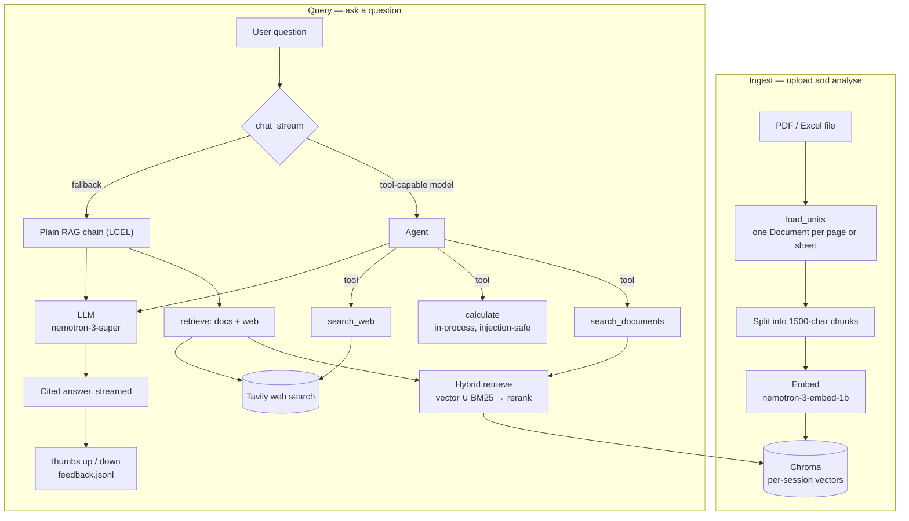

# ✨ DocMagic

> Grounded, cited question-answering over your logistics, ERP and CRM documents.


DocMagic is a retrieval-augmented document assistant for supply-chain and
operations teams. Upload SOPs, rate cards, contracts or inventory exports and
ask questions in plain language — every answer is grounded in your files and
cited to the exact page or sheet.

<!-- Add a screenshot:   -->

## Two architectures

The same product is built twice, on two branches, so the architectural trade-offs
are visible side by side. **Expand whichever you want to read.**

| | [`langgraph`](../../tree/langgraph) | [`langchain`](../../tree/langchain) |
|---|---|---|
| Frontend | Next.js + Tailwind | Streamlit |
| Backend | FastAPI, SSE | none — Streamlit is the server |
| Orchestration | LangGraph `StateGraph` | LangChain LCEL |
| Agents | supervisor → 4 capability specialists | one tool-calling agent |
| Vector store | pgvector on Postgres | Chroma (local) |
| Charts | Promptable Vega-Lite | Streamlit + Altair |
| Status | current | previously deployed |

---

<details open>
<summary><h3>🟢 &nbsp;<code>langgraph</code> — Next.js + FastAPI + multi-agent &nbsp;<i>(current)</i></h3></summary>


A supervisor routes each question to a capability specialist — documents,
spreadsheet data, arithmetic or live web search — so the model never juggles
every tool at once. Uploads run through an ingestion pipeline where a second
model reviews the summary against the source before you see it.

### Features

- **Cited answers** — responses quote the exact source, e.g. `[rate_card.xlsx Rates]` or `[sop.pdf p.3]`, and the model answers only from retrieved context.
- **Multi-agent routing** — a supervisor classifies each turn and hands it to one specialist (documents / data / quant / web), each holding only its own tools. Cleaner traces, and the model isn't choosing between every tool on every turn.
- **Reviewed ingestion** — `metadata → analyst → reviewer`, where the reviewer grounds the analyst's summary against the source excerpts and can bounce it back for exactly one revision (bounded — no runaway critic loop).
- **Hybrid retrieval + reranking** — dense vector search is fused with BM25 keyword search (exact terms like SKU codes and lane names), then a NVIDIA cross-encoder reranker (`llama-nemotron-rerank-vl-1b-v2`) re-scores the merged candidates.
- **Spreadsheet extraction** — uploaded sheets are written to Postgres, so the data specialist computes real statistics instead of inferring them from text.
- **PDF and Excel ingestion** — page-level parsing for PDFs, sheet-level for spreadsheets, with automatic detection of header rows buried under title/metadata blocks.
- **Streaming everywhere** — both the upload pipeline and the chat stream Server-Sent Events, so each agent step is visible as it happens.
- **Live document preview** — uploaded PDFs render side-by-side with the chat.
- **Feedback loop** — thumbs up/down on every answer, recorded in Postgres.
- **Tracing** — optional [Langfuse](https://langfuse.com) instrumentation captures every LLM call, tool use and retrieval; each graph node is its own span.
- **Session isolation** — an httpOnly cookie scopes each visitor's documents to their own pgvector collection and their own extracted tables.
- **Graceful degradation** — models without tool support fall back to a plain LCEL retrieval chain. Chat never hard-fails.

### Architecture



### Tech stack

| Layer | Technology |
|-------|-----------|
| Frontend | Next.js (App Router) + Tailwind |
| API | FastAPI, Server-Sent Events |
| Orchestration | LangGraph — chat supervisor + ingestion pipeline |
| Vector store | pgvector on Postgres |
| Retrieval | Hybrid vector + BM25 (`rank-bm25`), cross-encoder reranked |
| Embeddings | NVIDIA NIM — `nemotron-3-embed-1b` |
| Reranker | NVIDIA NIM — `llama-nemotron-rerank-vl-1b-v2` |
| LLM | NVIDIA NIM — `nemotron-3-super` (default); any OpenAI-compatible model |
| Agent & tools | LangChain `create_agent` — document search, table stats, web search, calculator |
| Web search | Tavily |
| Tracing | Langfuse (optional) |
| Data | pandas, extracted to Postgres |

### Getting started

**Prerequisites:** Python 3.10+, Node.js 20.9+, a free NVIDIA NIM API key
([build.nvidia.com](https://build.nvidia.com)), and a Postgres database with the
`vector` extension (free tier: [Supabase](https://supabase.com) or
[Neon](https://neon.tech)).

```bash
# API
python -m venv .venv
.venv\Scripts\activate          # Windows  (macOS/Linux: source .venv/bin/activate)
pip install -r requirements.txt
copy .env.example .env          # add your API key and POSTGRES_URL
uvicorn api:app --reload --port 8000

# frontend, in a second terminal
cd web
npm install
npm run dev                     # http://localhost:3000
```

Optionally add a free [Tavily](https://tavily.com) key (`TAVILY_API_KEY`) to
enable the **Search the web** toggle.

### Configuration

Set these in `.env`. The chat key can also be pasted in the sidebar at runtime.

| Variable | Description | Default |
|----------|-------------|---------|
| `POSTGRES_URL` | pgvector chunks + the `analytics` schema | _required_ |
| `LLM_API_KEY` | API key for chat completions | _required to chat_ |
| `LLM_BASE_URL` | OpenAI-compatible chat endpoint | `https://integrate.api.nvidia.com/v1` |
| `LLM_MODEL` | Chat model id | `nvidia/nemotron-3-super-120b-a12b` |
| `EMBED_API_KEY` | API key for embeddings | falls back to `LLM_API_KEY` |
| `EMBED_BASE_URL` | Embeddings endpoint | `https://integrate.api.nvidia.com/v1` |
| `EMBED_MODEL` | Embedding model id | `nvidia/nemotron-3-embed-1b` |
| `RERANK_MODEL` | Reranker model id | `nvidia/llama-nemotron-rerank-vl-1b-v2` |
| `RERANK_API_KEY` | API key for the reranker | falls back to `EMBED_API_KEY` |
| `TAVILY_API_KEY` | Enables the web-search tool (optional) | _unset_ |
| `LANGFUSE_PUBLIC_KEY` | Enables Langfuse tracing (optional) | _unset_ |
| `LANGFUSE_SECRET_KEY` | Langfuse secret key (required with the public key) | _unset_ |
| `LANGFUSE_BASE_URL` | Langfuse host | `https://cloud.langfuse.com` |
| `WEB_ORIGIN` | Frontend origin, for CORS | `http://localhost:3000` |
| `COOKIE_CROSS_SITE` | Set to `1` when the frontend is on another site | _unset_ |

The frontend reads `NEXT_PUBLIC_API_URL` (default `http://localhost:8000`).

### Deployment

Frontend on [Vercel](https://vercel.com); the API anywhere that runs a container.
Set `WEB_ORIGIN` to the deployed frontend origin and `COOKIE_CROSS_SITE=1` so the
session cookie survives cross-site requests.

Uploads go **directly** from the browser to the API — not through the Next.js
server — so they aren't capped by serverless request-body limits.

- Set `EMBED_API_KEY` to provide document search for free — visitors then only
  bring their own chat key.
- Optionally set `LLM_API_KEY` and `TAVILY_API_KEY` too, to run the whole app
  (chat + web search) without any visitor key.

### Project structure

```
api.py               # FastAPI: session cookie, SSE streams, error shaping
rag.py               # config, models, retrieval, Postgres storage, tool primitives
chat_graph.py        # chat supervisor: router → capability specialist → answer
ingest_graph.py      # upload pipeline: metadata → analyst → reviewer
test_rag.py          # unit tests: splitting, Excel parsing, graphs, API wiring
web/                 # Next.js frontend
  app/page.tsx       # state, both SSE streams, layout
  components/        # sidebar, chat
  lib/api.ts         # API client + SSE frame parser
```

### Testing

```bash
python test_rag.py     # backend
cd web && npm test     # SSE frame parser
```

### Roadmap

- More contextual Vega-Lite chart suggestions for uploaded spreadsheet data
- OCR for scanned / image-only PDFs (currently skipped — no text layer to read)
- Retrieval evaluation harness over the recorded feedback

</details>

---

<details>
<summary><h3>🔵 &nbsp;<code>langchain</code> — Streamlit + LCEL &nbsp;<i>(previous)</i></h3></summary>


**Live app:** [docmagic.streamlit.app](https://docmagic.streamlit.app/) ·
`git checkout langchain`

The whole app is one Streamlit file. A single tool-calling agent picks between
document search, web search and a calculator, and an analysis mode turns
spreadsheets into charts on request.

### Features

- **Cited answers** — responses quote the exact source, e.g. `[rate_card.xlsx Rates]` or `[sop.pdf p.3]`, and the model answers only from retrieved context.
- **Hybrid retrieval + reranking** — dense vector search (semantic meaning) is fused with BM25 keyword search (exact terms like SKU codes and lane names), then a NVIDIA cross-encoder reranker (`llama-nemotron-rerank-vl-1b-v2`) re-scores the merged candidates and keeps the most relevant — noticeably higher precision than vector search alone.
- **PDF and Excel ingestion** — page-level parsing for PDFs, sheet-level for spreadsheets, with automatic detection of header rows buried under title/metadata blocks.
- **Agentic tool use** — a tool-calling agent chooses per question between document search, live **web search** (Tavily), and an exact in-process **calculator** for rates, totals and GST; it falls back to a plain retrieval chain on models without tool support.
- **Conversational analytics** — describe a chart in natural language ("pie of shipments by status") and DocMagic renders it; bar, line, area, scatter and pie are supported.
- **Live document preview** — uploaded PDFs render side-by-side with the chat.
- **Feedback loop** — thumbs up/down on every answer, logged for later review.
- **Tracing** — optional [Langfuse](https://langfuse.com) instrumentation captures every LLM call, tool use and retrieval as a trace; automatically enabled when `LANGFUSE_*` keys are present, a no-op otherwise.
- **Session isolation** — each visitor's uploaded documents are private to their session.
- **Provider-agnostic** — runs on any OpenAI-compatible endpoint; the chat model is selectable at runtime and the API key can be supplied by the operator or pasted per user.
- **Production hardening** — runtime secrets, upload limits, session-scoped storage, sanitised error handling with server-side logging, and no third-party telemetry.

### Architecture



### Tech stack

| Layer | Technology |
|-------|-----------|
| UI | Streamlit |
| Orchestration | LangChain (LCEL) |
| Vector store | Chroma (local, persistent) |
| Retrieval | Hybrid vector + BM25 (`rank-bm25`), cross-encoder reranked |
| Embeddings | NVIDIA NIM — `nemotron-3-embed-1b` |
| Reranker | NVIDIA NIM — `llama-nemotron-rerank-vl-1b-v2` |
| LLM | NVIDIA NIM — `nemotron-3-super` (default); any OpenAI-compatible model |
| Agent & tools | LangChain `create_agent` — document search, web search, calculator |
| Web search | Tavily |
| Tracing | Langfuse (optional) |
| Data & charts | pandas, Vega/Altair |

### Getting started

**Prerequisites:** Python 3.10+ and a free NVIDIA NIM API key ([build.nvidia.com](https://build.nvidia.com)).

```bash
python -m venv .venv
.venv\Scripts\activate          # Windows  (macOS/Linux: source .venv/bin/activate)
pip install -r requirements.txt
copy .env.example .env          # add your API key
streamlit run app.py
```

Optionally add a free [Tavily](https://tavily.com) key (`TAVILY_API_KEY`) to
enable the **Search the web** toggle.

### Configuration

Set these in `.env`, in `.streamlit/secrets.toml` (TOML — see
`.streamlit/secrets.toml.example`), or in Streamlit Cloud Secrets. The chat key
can also be pasted in the sidebar at runtime.

| Variable | Description | Default |
|----------|-------------|---------|
| `LLM_API_KEY` | API key for chat completions | _required to chat_ |
| `LLM_BASE_URL` | OpenAI-compatible chat endpoint | `https://integrate.api.nvidia.com/v1` |
| `LLM_MODEL` | Chat model id | `nvidia/nemotron-3-super-120b-a12b` |
| `EMBED_API_KEY` | API key for embeddings | falls back to `LLM_API_KEY` |
| `EMBED_BASE_URL` | Embeddings endpoint | `https://integrate.api.nvidia.com/v1` |
| `EMBED_MODEL` | Embedding model id | `nvidia/nemotron-3-embed-1b` |
| `RERANK_MODEL` | Reranker model id | `nvidia/llama-nemotron-rerank-vl-1b-v2` |
| `RERANK_API_KEY` | API key for the reranker | falls back to `EMBED_API_KEY` |
| `TAVILY_API_KEY` | Enables the web-search tool (optional) | _unset_ |
| `LANGFUSE_PUBLIC_KEY` | Enables Langfuse tracing (optional) | _unset_ |
| `LANGFUSE_SECRET_KEY` | Langfuse secret key (required with the public key) | _unset_ |
| `LANGFUSE_BASE_URL` | Langfuse host | `https://cloud.langfuse.com` |

### Deployment

Deploy on [Streamlit Community Cloud](https://share.streamlit.io): point it at
`app.py` and add keys under the app's **Secrets** (TOML):

- Set `EMBED_API_KEY` to provide document search for free — visitors then only
  bring their own chat key.
- Optionally set `LLM_API_KEY` and `TAVILY_API_KEY` too, to run the whole app
  (chat + web search) without any visitor key.

Uploaded documents live per session on ephemeral disk — fine for a demo, and
there is nothing to rebuild after a restart.

### Project structure

```
app.py                  # Streamlit app: UI, RAG pipeline, agent tools, analytics
test_rag.py             # Unit tests: splitting, retrieval, Excel parsing
.streamlit/config.toml  # Theme and server configuration
```

### Testing

```bash
python test_rag.py
```

</details>

---

## License

Released under the [MIT License](LICENSE).
