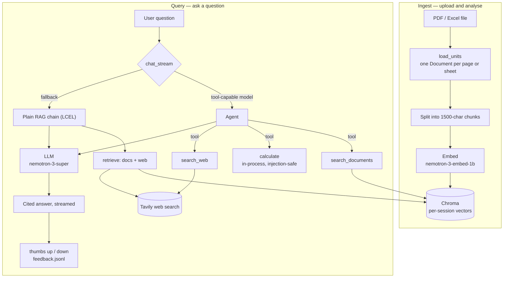

# ✨ DocMagic

> Grounded, cited question-answering over your logistics, ERP and CRM documents.


DocMagic is a retrieval-augmented document assistant for supply-chain and
operations teams. Upload SOPs, rate cards, contracts or inventory exports and
ask questions in plain language — every answer is grounded in your files and
cited to the exact page or sheet. A tool-using agent adds live web search and an
exact calculator when a question needs them, and an analysis mode turns
spreadsheets into charts on request.

## Demo

**Live app:** [docmagic.streamlit.app](https://docmagic.streamlit.app/)

<!-- Add a screenshot:   -->

## Features

- **Cited answers** — responses quote the exact source, e.g. `[rate_card.xlsx Rates]` or `[sop.pdf p.3]`, and the model answers only from retrieved context.
- **PDF and Excel ingestion** — page-level parsing for PDFs, sheet-level for spreadsheets, with automatic detection of header rows buried under title/metadata blocks.
- **Agentic tool use** — a tool-calling agent chooses per question between document search, live **web search** (Tavily), and an exact in-process **calculator** for rates, totals and GST; it falls back to a plain retrieval chain on models without tool support.
- **Conversational analytics** — describe a chart in natural language ("pie of shipments by status") and DocMagic renders it; bar, line, area, scatter and pie are supported.
- **Live document preview** — uploaded PDFs render side-by-side with the chat.
- **Feedback loop** — thumbs up/down on every answer, logged for later review.
- **Session isolation** — each visitor's uploaded documents are private to their session.
- **Provider-agnostic** — runs on any OpenAI-compatible endpoint; the chat model is selectable at runtime and the API key can be supplied by the operator or pasted per user.
- **Production hardening** — runtime secrets, upload limits, session-scoped storage, sanitised error handling with server-side logging, and no third-party telemetry.

## Architecture



## Tech stack

| Layer | Technology |
|-------|-----------|
| UI | Streamlit |
| Orchestration | LangChain (LCEL) |
| Vector store | Chroma (local, persistent) |
| Embeddings | NVIDIA NIM — `nemotron-3-embed-1b` |
| LLM | NVIDIA NIM — `nemotron-3-super` (default); any OpenAI-compatible model |
| Agent & tools | LangChain `create_agent` — document search, web search, calculator |
| Web search | Tavily |
| Data & charts | pandas, Vega/Altair |

## Getting started

**Prerequisites:** Python 3.10+ and a free NVIDIA NIM API key ([build.nvidia.com](https://build.nvidia.com)).

```bash
python -m venv .venv
.venv\Scripts\activate          # Windows  (macOS/Linux: source .venv/bin/activate)
pip install -r requirements.txt
copy .env.example .env          # add your API key
streamlit run app.py
```

Optionally add a free [Tavily](https://tavily.com) key (`TAVILY_API_KEY`) to
enable the **Search the web** toggle.

## Configuration

Set these in `.env`, in `.streamlit/secrets.toml` (TOML — see
`.streamlit/secrets.toml.example`), or in Streamlit Cloud Secrets. The chat key
can also be pasted in the sidebar at runtime.

| Variable | Description | Default |
|----------|-------------|---------|
| `LLM_API_KEY` | API key for chat completions | _required to chat_ |
| `LLM_BASE_URL` | OpenAI-compatible chat endpoint | `https://integrate.api.nvidia.com/v1` |
| `LLM_MODEL` | Chat model id | `nvidia/nemotron-3-super-120b-a12b` |
| `EMBED_API_KEY` | API key for embeddings | falls back to `LLM_API_KEY` |
| `EMBED_BASE_URL` | Embeddings endpoint | `https://integrate.api.nvidia.com/v1` |
| `EMBED_MODEL` | Embedding model id | `nvidia/nemotron-3-embed-1b` |
| `TAVILY_API_KEY` | Enables the web-search tool (optional) | _unset_ |

## Deployment

Deploy on [Streamlit Community Cloud](https://share.streamlit.io): point it at
`app.py` and add keys under the app's **Secrets** (TOML):

- Set `EMBED_API_KEY` to provide document search for free — visitors then only
  bring their own chat key.
- Optionally set `LLM_API_KEY` and `TAVILY_API_KEY` too, to run the whole app
  (chat + web search) without any visitor key.

Uploaded documents live per session on ephemeral disk — fine for a demo, and
there is nothing to rebuild after a restart.

## Project structure

```
app.py                  # Streamlit app: UI, RAG pipeline, agent tools, analytics
test_rag.py             # Unit tests: splitting, retrieval, Excel parsing
.streamlit/config.toml  # Theme and server configuration
```

## Testing

```bash
python test_rag.py
```

## Roadmap

- Reranking for higher retrieval precision
- Hybrid keyword + vector search

## License

Released under the [MIT License](LICENSE).
