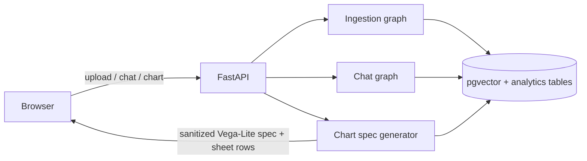

# DocMagic V2 plan

V2 is the active `langgraph` application: a Next.js frontend backed by FastAPI,
LangGraph, and pgvector. It replaces the feature-frozen Streamlit fallback on the
`langchain` branch.

## Delivered

- Next.js 16 frontend with upload/source preview and streaming chat.
- FastAPI SSE endpoints for upload, chat, and promptable charts.
- Session-isolated pgvector document collections and extracted Excel tables.
- LangGraph ingestion pipeline: metadata -> analyst -> reviewer, with one bounded
  revision at most.
- Chat supervisor that routes to document, spreadsheet-data, calculation, or web
  specialists.
- Vega-Lite chart generation: the backend attaches uploaded sheet rows to a
  sanitized model-generated spec; the browser never follows a model-provided URL.
- Post-upload analysis view below the upload/chat workspace. It contains the
  reviewed summary and a promptable chart view. Chart ideas are derived from the
  uploaded sheet's actual column names and data types.

## Current architecture

## Next priorities

1. Add OCR for scanned PDFs.
2. Build a retrieval-evaluation harness from recorded feedback.
3. Deploy the frontend and API, then retire the fallback demo once the V2 URL is stable.

## Deliberate limits

- No accounts or authentication: the session cookie isolates anonymous visitors.
- No background queue, Redis, or worker fleet at the current scale.
- No arbitrary browser data fetches in chart specs; chart data always comes from the
  current session's extracted spreadsheet table.
